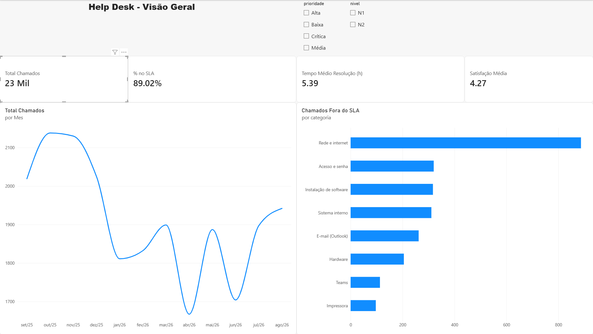
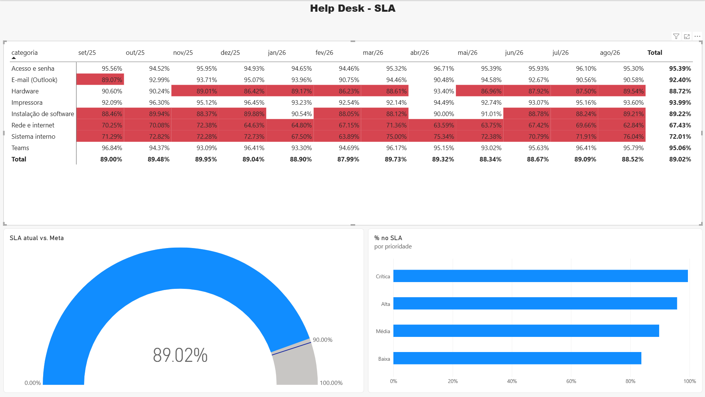
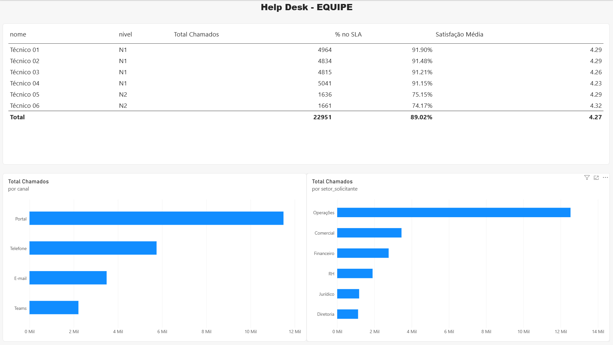
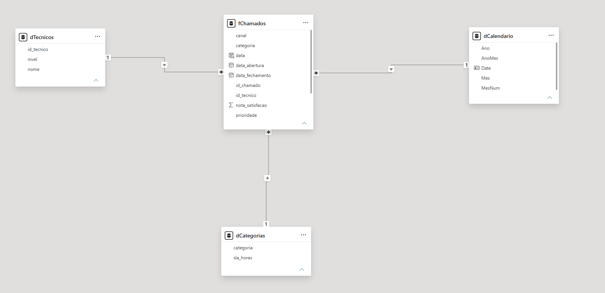
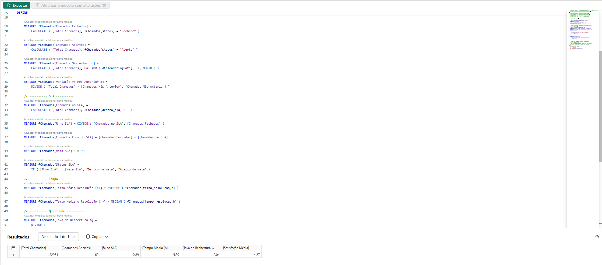
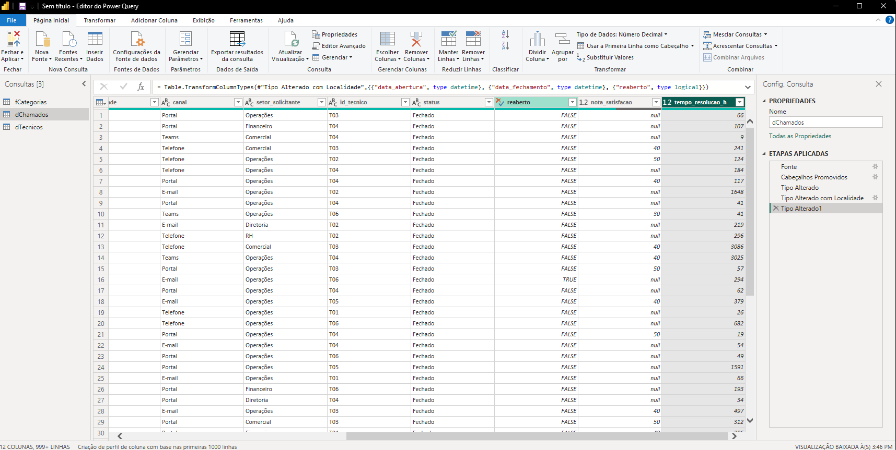
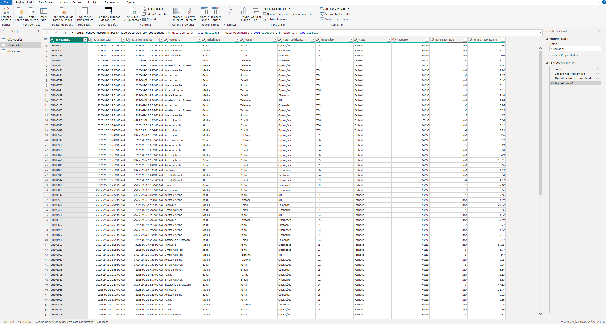

# Dashboard de Help Desk (Power BI + Python)

Indicadores de uma central de suporte: volume de chamados, SLA, tempo de resolução, reabertura e satisfação. Os dados são **fictícios**, gerados por um script Python que simula cerca de 2.000 chamados por mês durante 12 meses (22.951 chamados).

O projeto tem duas partes:

1. **Python:** gera a base de dados e produz um relatório automático em Markdown
2. **Power BI:** dashboard interativo em modelo estrela, com medidas DAX

## O dashboard

### Visão geral

Volume, SLA, tempo médio e satisfação, com a evolução mensal e as categorias que mais estouram o prazo.



### SLA

Onde e quando o SLA fica abaixo da meta de 90%. As células em vermelho são os meses abaixo da meta.



### Equipe

Volume, SLA e satisfação por técnico, e a origem dos chamados por canal e por setor.



## O que os dados mostram

- **O SLA geral é de 89%, um ponto abaixo da meta de 90%.** O problema não está espalhado: duas categorias puxam o resultado para baixo.
- **"Rede e internet" (67%) e "Sistema interno" (72%)** ficam abaixo da meta em todos os meses. As outras seis categorias ficam entre 88% e 95%. É onde uma revisão de processo dá o maior ganho.
- **O N2 tem SLA de 75% contra 91% do N1, com a mesma satisfação (4,2 a 4,3).** O N2 atende justamente as categorias mais demoradas. Comparar os dois níveis sem considerar o tipo de chamado levaria a uma conclusão errada sobre a equipe.
- **Chamados críticos têm o melhor SLA e os de prioridade baixa, o pior.** A priorização funciona.
- **O Portal concentra metade dos chamados**, e o setor de Operações é o maior solicitante.

## Modelo de dados (estrela)

Uma tabela de fatos (`fChamados`) e três dimensões, com relacionamentos de um para muitos.



| Tabela | Tipo | Conteúdo |
| --- | --- | --- |
| `fChamados` | Fato | Um chamado por linha: datas, categoria, prioridade, canal, setor, técnico, status, tempo e nota |
| `dCategorias` | Dimensão | Categoria e SLA em horas |
| `dTecnicos` | Dimensão | Técnico e nível (N1/N2) |
| `dCalendario` | Dimensão | Calendário criado em DAX, marcado como tabela de data |

## Validação das medidas

As 16 medidas DAX foram conferidas contra o relatório gerado pelo script Python, que calcula os mesmos indicadores com pandas. Os números batem nas duas ferramentas.



| Indicador | Python (pandas) | Power BI (DAX) |
| --- | --- | --- |
| Total de chamados | 22.951 | 22.951 |
| Chamados abertos | 69 | 69 |
| % no SLA | 89,0% | 89,02% |
| Tempo médio de resolução | 5,4 h | 5,39 h |
| Taxa de reabertura | 4,1% | 4% |
| Satisfação média | 4,27 | 4,27 |

## Problemas que encontrei e como resolvi

| Sintoma | Causa | Solução |
| --- | --- | --- |
| `tempo_resolucao_h` mostrava 66 em vez de 0,66; a nota de satisfação mostrava 50 em vez de 5 | O CSV usa vírgula decimal (padrão brasileiro) e o Power BI leu no padrão americano, em que a vírgula é separador de milhar | No Power Query, removi a etapa automática "Tipo Alterado" e apliquei **Alterar Tipo > Usando a Localidade > Português (Brasil)** |
| Tabela `dTecnicos` com colunas Column1, Column2, Column3 | O Power Query não promoveu o cabeçalho, porque todas as colunas eram texto | **Usar a Primeira Linha como Cabeçalho** |
| Meses em ordem alfabética nos gráficos | A coluna `Mes` é texto | Coluna `AnoMes` numérica e **Classificar por coluna** |
| Indicador de SLA com o arco vazio | A meta estava na caixa "Valor mínimo" | Meta em "Valor de destino" e escala fixa de 0 a 1 |

Antes e depois da correção do separador decimal, no Power Query:





## Estrutura

```
helpdesk-dashboard-powerbi/
├── dados/
│   ├── chamados.csv       # fato: 1 linha por chamado (22.951 linhas)
│   ├── categorias.csv     # dimensão: categoria + SLA em horas
│   └── tecnicos.csv       # dimensão: técnico + nível
├── scripts/
│   ├── gerar_dados.py     # gera a base fictícia
│   └── relatorio.py       # gera o relatório automático
├── relatorio/             # exemplo de relatório gerado
├── powerbi/
│   ├── Helpdesk.pbix                  # arquivo do dashboard
│   ├── medidas.dax                    # tabela calendário, colunas e medidas comentadas
│   └── medidas-todas-de-uma-vez.dax   # cria e confere as medidas pela consulta DAX
└── docs/prints/           # imagens deste README
```

## Como abrir

1. Instale o **Power BI Desktop** (gratuito).
2. Abra `powerbi/Helpdesk.pbix`. Os dados já estão dentro do arquivo.

## Como rodar a parte em Python

```bash
pip install -r requirements.txt

# Gera 12 meses de dados (mesma semente = mesmos dados)
python scripts/gerar_dados.py

# Relatório com todos os meses ou só os últimos 3
python scripts/relatorio.py
python scripts/relatorio.py --ultimos-meses 3
```

Veja um [exemplo de relatório gerado](relatorio/relatorio_20260930.md).

## Como o dashboard foi montado

1. **Power Query:** carga dos três CSVs, correção de tipos com localidade e promoção de cabeçalho
2. **Modelo:** tabela calendário em DAX, coluna `data` e três relacionamentos (esquema em estrela)
3. **Coluna calculada `dentro_sla`:** compara o tempo de cada chamado com o SLA da categoria, usando `RELATED`
4. **Medidas:** 16 medidas DAX, criadas e conferidas pela exibição de consulta DAX
5. **Relatório:** três páginas, com segmentações, formatação condicional e indicador de meta

## O que pratiquei

Python com pandas (geração e tratamento de dados, agregações, relatório automático), Power Query (tipos e localidade), modelagem em estrela, DAX (`CALCULATE`, `DIVIDE`, `RELATED`, `DATEADD`, `RANKX`), formatação condicional e leitura de indicadores de suporte (SLA, reabertura, satisfação).

---

Autor: **Warlley Santos** · [LinkedIn](https://linkedin.com/in/warlley-santos)
